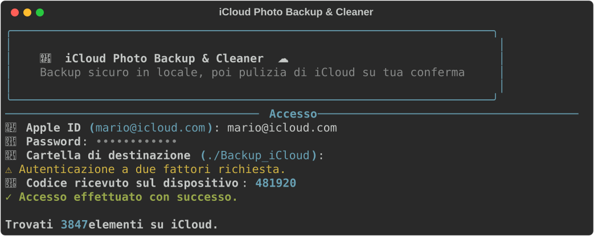
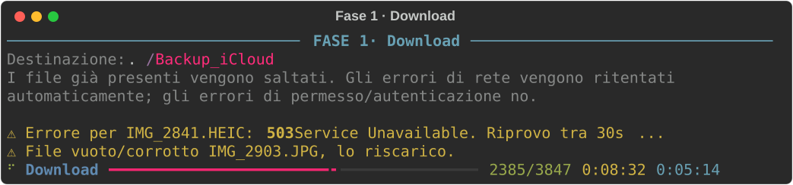
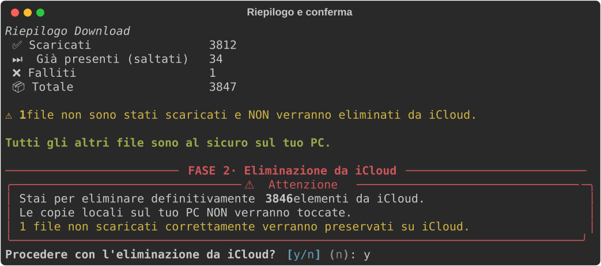
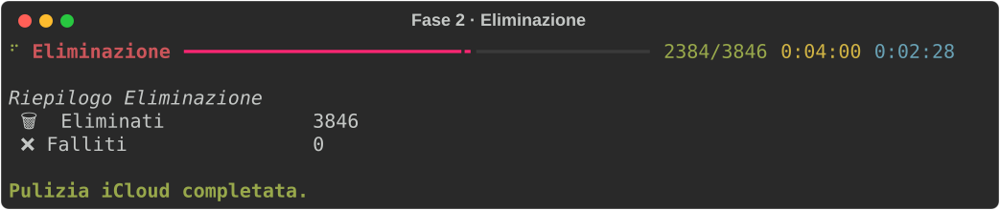

# iCloud Photo Backup & Cleaner 📸 ☁️

Script Python da terminale per **scaricare l'intera libreria iCloud Photos** sul proprio computer, organizzarla in cartelle ordinate e — solo dopo che il backup è riuscito — **liberare spazio su iCloud** eliminando le foto dal cloud.

<p align="center">
  
</p>

---

## ✨ Cosa fa

| | |
|---|---|
| 📅 **Organizzazione automatica** | I file vengono ordinati in `Anno / Mese / Foto o Video`, non ammassati in un'unica cartella |
| ⏸️ **Riprendibile** | I file già scaricati vengono saltati: se il backup si interrompe, basta rilanciarlo |
| 📊 **Barre di progresso** | Contatore file, tempo trascorso e **tempo rimanente stimato**, sia in download che in eliminazione |
| 💾 **Ricorda le impostazioni** | Email e cartella di destinazione vengono riproposte al prossimo avvio |
| 🔐 **Password mai salvata** | Input nascosto a runtime, nessuna credenziale scritta nel codice o su disco |
| 🔁 **Retry intelligente** | Ritenta automaticamente sugli errori di rete, si ferma su quelli irrecuperabili |
| 🛡️ **Eliminazione sicura** | Avviene solo dopo il download completo, con conferma esplicita, e **salta i file non scaricati** |
| 🎞️ **Video pesanti** | Download a blocchi (chunk) per non saturare la memoria con i 4K |

---

# 📖 GUIDA COMPLETA (da zero)

> Questa guida presuppone che tu **non abbia mai usato il terminale**. Ogni comando va scritto e poi confermato premendo **Invio**.

## Passo 0 — Apri il terminale

Il "terminale" è la finestra in cui si scrivono comandi testuali.

| Sistema | Come aprirlo |
|---|---|
| 🍎 **macOS** | Premi `Cmd` + `Spazio`, scrivi `Terminale`, premi Invio |
| 🪟 **Windows** | Premi il tasto `Windows`, scrivi `PowerShell`, premi Invio |
| 🐧 **Linux** | Premi `Ctrl` + `Alt` + `T` |

Si apre una finestra con una riga di testo e un cursore che lampeggia. È lì che scriverai.

---

## Passo 1 — Controlla di avere Python

Scrivi questo comando e premi Invio:

**macOS / Linux:**
```bash
python3 --version
```

**Windows:**
```powershell
python --version
```

✅ **Se risponde** qualcosa come `Python 3.11.15` → sei a posto, vai al Passo 2.

❌ **Se risponde** `command not found` o `non riconosciuto` → Python non è installato:
1. Vai su [python.org/downloads](https://www.python.org/downloads/)
2. Scarica l'ultima versione e installala
3. ⚠️ **Su Windows**, durante l'installazione spunta la casella **"Add Python to PATH"** in fondo alla prima schermata, altrimenti il terminale non lo troverà
4. **Chiudi e riapri il terminale**, poi riprova il comando

> Serve Python **3.8 o superiore**. Il numero dopo il primo punto deve essere almeno 8 (es. `3.8`, `3.11`, `3.13` vanno tutti bene).

---

## Passo 2 — Controlla di avere Git

Git serve a scaricare il progetto. Scrivi:

```bash
git --version
```

✅ **Se risponde** `git version 2.43.0` (o simile) → vai al Passo 3.

❌ **Se non è installato**, hai due possibilità:

* **Opzione A (consigliata)**: installa Git da [git-scm.com/downloads](https://git-scm.com/downloads), poi riapri il terminale.
* **Opzione B (senza Git)**: vai sulla [pagina del progetto](https://github.com/emanuelediluzio/downloadanddeleteallphotosicloud), clicca il pulsante verde **`Code`** → **`Download ZIP`**, poi estrai la cartella (per esempio sul Desktop) e **salta direttamente al Passo 4**.

---

## Passo 3 — Scarica il progetto (clone)

### 3a. Scegli dove metterlo

Prima di scaricare devi decidere **in quale cartella** finirà il progetto. Usiamo il **Desktop**, così lo vedi subito.

Il comando `cd` significa "*change directory*", cioè "spostati nella cartella".

**macOS / Linux:**
```bash
cd ~/Desktop
```

**Windows:**
```powershell
cd $HOME\Desktop
```

> `~` (macOS/Linux) e `$HOME` (Windows) sono scorciatoie che indicano la tua cartella utente personale.

Per essere sicuro di dove ti trovi, scrivi:

**macOS / Linux:**
```bash
pwd
```
**Windows:**
```powershell
Get-Location
```

Deve rispondere qualcosa che finisce con `/Desktop` (o `\Desktop`).

### 3b. Scarica il progetto

Ora scrivi (uguale su tutti i sistemi):

```bash
git clone https://github.com/emanuelediluzio/downloadanddeleteallphotosicloud.git
```

Vedrai scorrere qualche riga tipo `Cloning into...`, `done.`.
Sul tuo Desktop è ora comparsa una cartella chiamata `downloadanddeleteallphotosicloud`.

### 3c. Entra dentro la cartella appena scaricata

```bash
cd downloadanddeleteallphotosicloud
```

Verifica di essere nel posto giusto elencando i file:

**macOS / Linux:**
```bash
ls
```
**Windows:**
```powershell
dir
```

Devi vedere elencato **`photodeleter.py`** e **`requirements.txt`**. Se li vedi, sei nel punto giusto. 🎯

> ⚠️ **Importante**: tutti i comandi dei passi successivi vanno dati **da dentro questa cartella**. Se chiudi il terminale e lo riapri, devi rifare `cd ~/Desktop/downloadanddeleteallphotosicloud` prima di continuare.

---

## Passo 4 — Crea l'ambiente virtuale

Un "ambiente virtuale" è una scatola isolata dove installare le librerie del progetto senza sporcare il resto del computer. Su Mac e Linux recenti è **obbligatorio**, altrimenti Python rifiuta l'installazione.

**macOS / Linux:**
```bash
python3 -m venv .venv
source .venv/bin/activate
```

**Windows (PowerShell):**
```powershell
python -m venv .venv
.venv\Scripts\Activate.ps1
```

✅ Se ha funzionato, all'inizio della riga del terminale compare la scritta **`(.venv)`**. Significa che sei dentro l'ambiente virtuale.

> 🪟 **Se Windows dice** *"esecuzione di script disabilitata"*, scrivi questo comando e poi riprova ad attivare:
> ```powershell
> Set-ExecutionPolicy -Scope Process -ExecutionPolicy Bypass
> ```

> 🔁 **Ogni volta che riapri il terminale** per usare lo script, devi rifare il comando di attivazione (`source .venv/bin/activate` oppure `.venv\Scripts\Activate.ps1`). Non devi invece ricreare il venv.

---

## Passo 5 — Installa le librerie necessarie

Con `(.venv)` visibile nella riga, scrivi:

```bash
pip install -r requirements.txt
```

Partirà il download di due librerie: `pyicloud` (per parlare con iCloud) e `rich` (per la grafica del terminale).
Attendi finché non compare `Successfully installed ...`.

---

## Passo 6 — Avvia lo script

**macOS / Linux:**
```bash
python3 photodeleter.py
```

**Windows:**
```powershell
python photodeleter.py
```

Comparirà il riquadro azzurro con il titolo del programma. 🎉

---

## Passo 7 — Inserisci i tuoi dati

Lo script ti farà tre domande, una alla volta.

**1. `📧 Apple ID`**
Scrivi l'email del tuo account Apple (es. `mario.rossi@icloud.com`) e premi Invio.

**2. `🔑 Password`**
Scrivi la password del tuo account Apple e premi Invio.

> 👀 **Mentre digiti non vedrai comparire nulla**, nemmeno i pallini. È normale ed è una misura di sicurezza: il terminale nasconde la password. Scrivi e premi Invio anche se sembra che non stia scrivendo niente.

**3. `📁 Cartella di destinazione`**
È dove verranno salvate le foto. Tra parentesi vedi il valore predefinito `./Backup_iCloud`: premi semplicemente **Invio** per accettarlo e le foto finiranno in una cartella `Backup_iCloud` dentro la cartella del progetto.

> Se vuoi salvarle altrove, ad esempio su un disco esterno, scrivi il percorso completo, ad esempio:
> * macOS: `/Volumes/DiscoEsterno/Foto`
> * Windows: `D:\Foto`

---

## Passo 8 — Codice di verifica (2FA)

Se il tuo account ha l'autenticazione a due fattori (quasi tutti ce l'hanno), sul tuo iPhone/Mac comparirà un avviso con un **codice a 6 cifre**.

Scrivi quelle 6 cifre nel terminale e premi Invio.

✅ Quando compare `✓ Accesso effettuato con successo` sei dentro. Lo script ti dirà quanti elementi ha trovato, per esempio `Trovati 3847 elementi su iCloud.`

---

## Passo 9 — Aspetta il download (Fase 1)

Parte il download. Vedrai una barra che avanza:



Cosa significano i numeri, da sinistra a destra:
* **`2385/3847`** → file scaricati su totale
* **`0:08:32`** → da quanto sta lavorando
* **`0:05:14`** → **quanto manca** (stima)

⏱️ Con migliaia di foto può volerci **anche qualche ora**. Puoi lasciare la finestra aperta e fare altro.

**Se vedi righe gialle** tipo `⚠ Errore ... Riprovo tra 30s` → è tutto normale: i server Apple ogni tanto rallentano e lo script riprova da solo. Non toccare nulla.

**Puoi interrompere quando vuoi** premendo `Ctrl` + `C`. Per riprendere in seguito basta rilanciare lo script: i file già scaricati verranno saltati e ripartirà da dove era rimasto.

---

## Passo 10 — Controlla il riepilogo

A fine download compare la tabella riassuntiva:



> 🛑 **FERMATI E CONTROLLA QUI.** Prima di rispondere alla domanda successiva, apri la cartella `Backup_iCloud` con il tuo file manager (Finder su Mac, Esplora file su Windows) e verifica con i tuoi occhi che le foto ci siano davvero e si aprano correttamente. Una volta cancellate da iCloud non si torna indietro.

---

## Passo 11 — Decidi se cancellare da iCloud (Fase 2)

Lo script chiede: **`Procedere con l'eliminazione da iCloud? [y/n] (n):`**

* Scrivi **`n`** (oppure premi solo Invio) → **non cancella niente**. Le foto restano sia sul PC che su iCloud. Il programma termina.
* Scrivi **`y`** → cancella le foto **da iCloud**. ⚠️ **Le copie scaricate sul tuo computer NON vengono toccate**, restano al sicuro.

Se hai scelto `y`, parte la seconda barra di progresso e alla fine vedrai `Pulizia iCloud completata`.



**Hai finito.** 🎉

---

## Passo 12 — Dove sono finite le mie foto?

Nella cartella che hai scelto, ordinate per anno, mese e tipo:

```text
Backup_iCloud/
├── 2023/
│   ├── 01/
│   │   ├── Foto/
│   │   │   └── IMG_001.JPG
│   │   └── Video/
│   │       └── VIDEO_002.MOV
│   └── 05/
│       └── Foto/
│           └── IMG_042.HEIC
└── 2024/
    └── 12/
        └── Foto/
            └── IMG_999.PNG
```

---

## 🔄 Come rilanciarlo in futuro

Riapri il terminale e dai questi tre comandi in fila:

**macOS / Linux:**
```bash
cd ~/Desktop/downloadanddeleteallphotosicloud
source .venv/bin/activate
python3 photodeleter.py
```

**Windows:**
```powershell
cd $HOME\Desktop\downloadanddeleteallphotosicloud
.venv\Scripts\Activate.ps1
python photodeleter.py
```

Email e cartella di destinazione te le ricorderà lui: basta premere Invio per confermarle.

---

# 🆘 Problemi comuni

| Messaggio d'errore | Cosa significa e come si risolve |
|---|---|
| `command not found: python3` <br> `python non è riconosciuto` | Python non è installato o non è nel PATH → rifai il **Passo 1**. Su Windows reinstalla spuntando *"Add Python to PATH"* |
| `No such file or directory: photodeleter.py` | Non sei dentro la cartella del progetto → rifai `cd ~/Desktop/downloadanddeleteallphotosicloud` (**Passo 3c**) |
| `externally-managed-environment` | Stai installando fuori dall'ambiente virtuale → rifai il **Passo 4** e controlla che compaia `(.venv)` |
| `✗ Credenziali errate` | Email o password sbagliate. Se sei sicuro che siano giuste, genera una **password per app** dalla sezione sicurezza del tuo account su `appleid.apple.com` e usa quella |
| `✗ Codice non valido` | Il codice a 6 cifre è scaduto o digitato male → rilancia lo script e usa il nuovo codice |
| `esecuzione di script è disabilitata` (Windows) | Esegui `Set-ExecutionPolicy -Scope Process -ExecutionPolicy Bypass` e riprova ad attivare il venv |
| `✗ Errore filesystem locale` | Disco pieno o permessi negati → libera spazio o scegli un'altra cartella di destinazione |
| Righe gialle `⚠ Riprovo tra 30s` | **Non è un errore.** I server Apple sono occupati, lo script riprova da solo. Aspetta |

---

# ⚙️ Uso avanzato

## Variabili d'ambiente (per automazioni)

Per evitare i prompt interattivi:

**macOS / Linux:**
```bash
export ICLOUD_EMAIL="tuo_id@icloud.com"
export ICLOUD_PASSWORD="tua_password"
export ICLOUD_BACKUP_PATH="./Backup_iCloud"
python3 photodeleter.py
```

**Windows (PowerShell):**
```powershell
$env:ICLOUD_EMAIL="tuo_id@icloud.com"
$env:ICLOUD_PASSWORD="tua_password"
$env:ICLOUD_BACKUP_PATH=".\Backup_iCloud"
python photodeleter.py
```

| Variabile | Descrizione |
|---|---|
| `ICLOUD_EMAIL` | Apple ID |
| `ICLOUD_PASSWORD` | Password (o password specifica per app) |
| `ICLOUD_BACKUP_PATH` | Cartella locale di destinazione |

> ⚠️ Usando questo metodo la password resta nella cronologia della shell. Preferisci il metodo interattivo se il computer è condiviso.

## Impostazioni memorizzate

Email e cartella di destinazione vengono salvate in `~/.icloud_photodeleter_config.json` e riproposte come predefinite. **La password non viene mai salvata su disco.** Per azzerare le impostazioni, cancella quel file.

## Gestione degli errori

Lo script distingue tre tipi di problema, per non restare mai bloccato all'infinito:

| Tipo di errore | Comportamento |
|---|---|
| **Rete / server occupato** (503, connessione persa) | Ritenta automaticamente con attesa progressiva (5s → 10s → 30s), senza perdere nessun file |
| **Autenticazione / permessi** (401, 403) | Ritenta 3 volte, poi salta il file e lo segnala: viene **escluso dall'eliminazione** su iCloud |
| **Disco locale** (spazio esaurito, permessi negati) | Interrompe subito lo script con un messaggio chiaro, invece di ritentare a vuoto |

I file da 0 byte (download corrotti) vengono rilevati e riscaricati automaticamente.

## Rigenerare gli screenshot

Se modifichi l'interfaccia, aggiorna le immagini del README con:

```bash
python docs/generate_screenshots.py
```

---

# ⚠️ Avvertenze importanti

* **Verifica lo spazio libero**: una libreria iCloud può pesare decine o centinaia di GB. Controlla di avere spazio sufficiente **prima** di iniziare.
* **L'eliminazione è definitiva**: una volta confermata con `y`, i file passano nel cestino di iCloud o vengono rimossi in modo permanente a seconda delle impostazioni del tuo account.
* **Controlla sempre il backup prima di cancellare**: apri la cartella e verifica che le foto ci siano e si aprano.
* **Connessione stabile**: meglio via cavo o Wi-Fi affidabile. In caso di interruzione, comunque, lo script riprende da dove era rimasto.

---

# 🔮 Roadmap / To-Do

* **☁️ Supporto Multi-Cloud**: caricamento diretto su Google Drive, OneDrive e Dropbox.
* **🔄 Streaming Transfer**: trasferimento "pipe" da iCloud al cloud di destinazione senza salvare i file in locale.
* **🔐 Crittografia (opzionale)**: cifratura dei file prima dell'upload sul cloud di destinazione.
