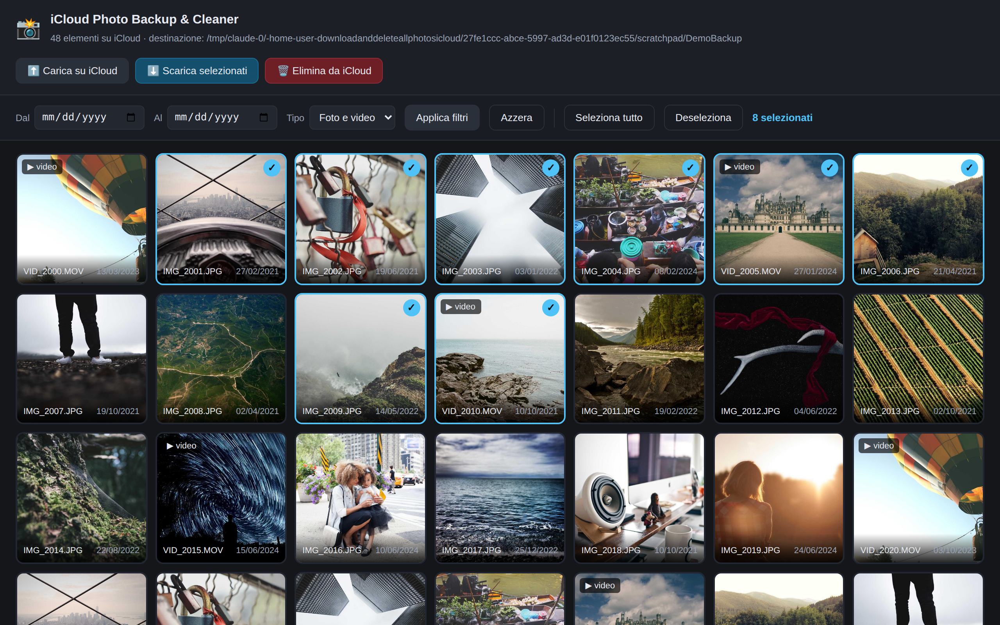
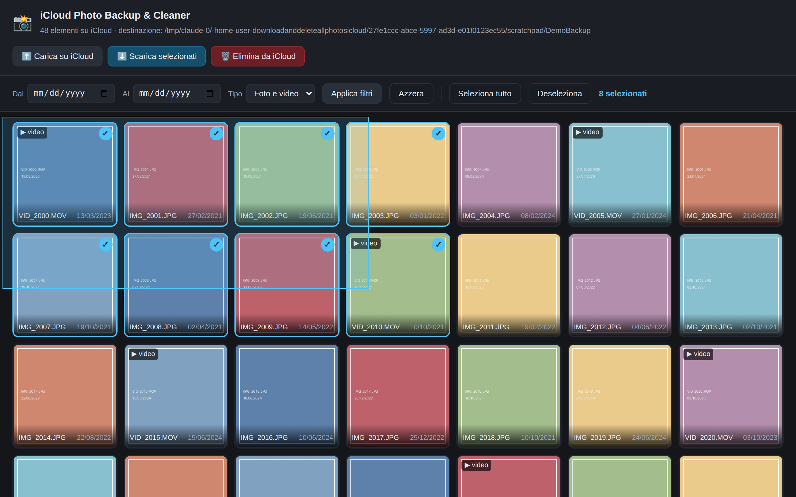
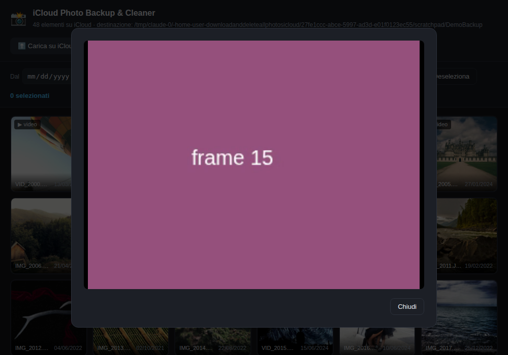
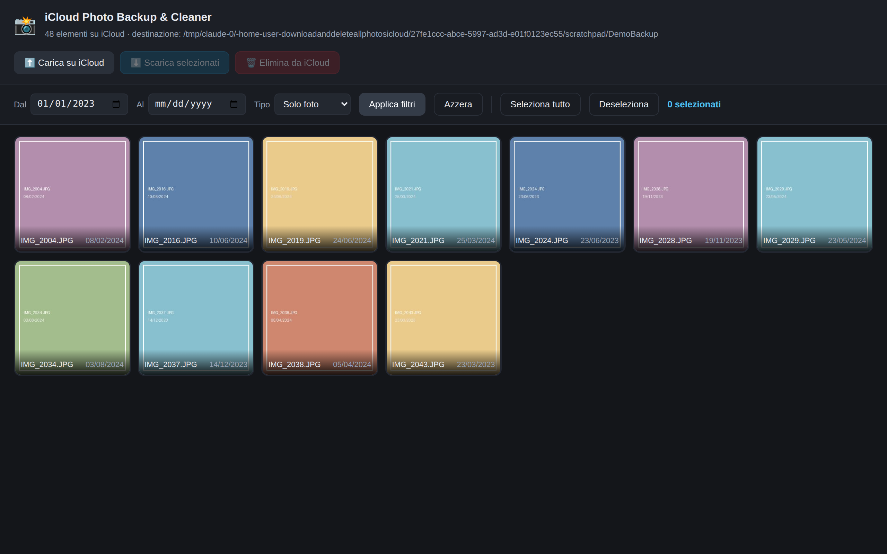
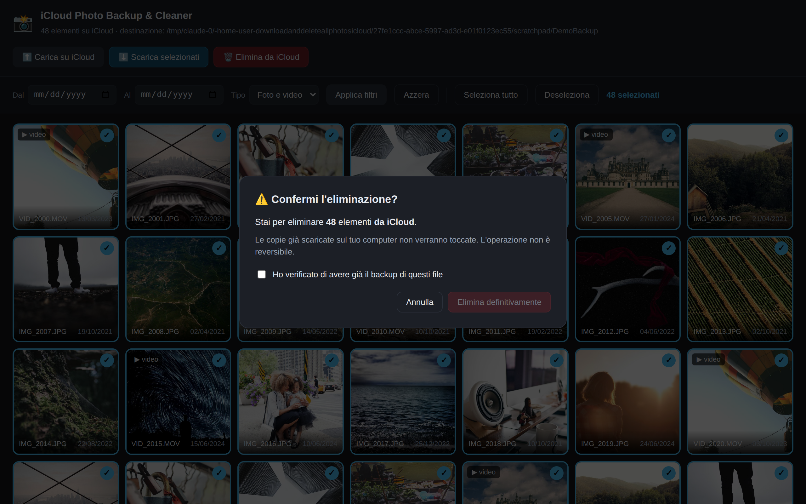
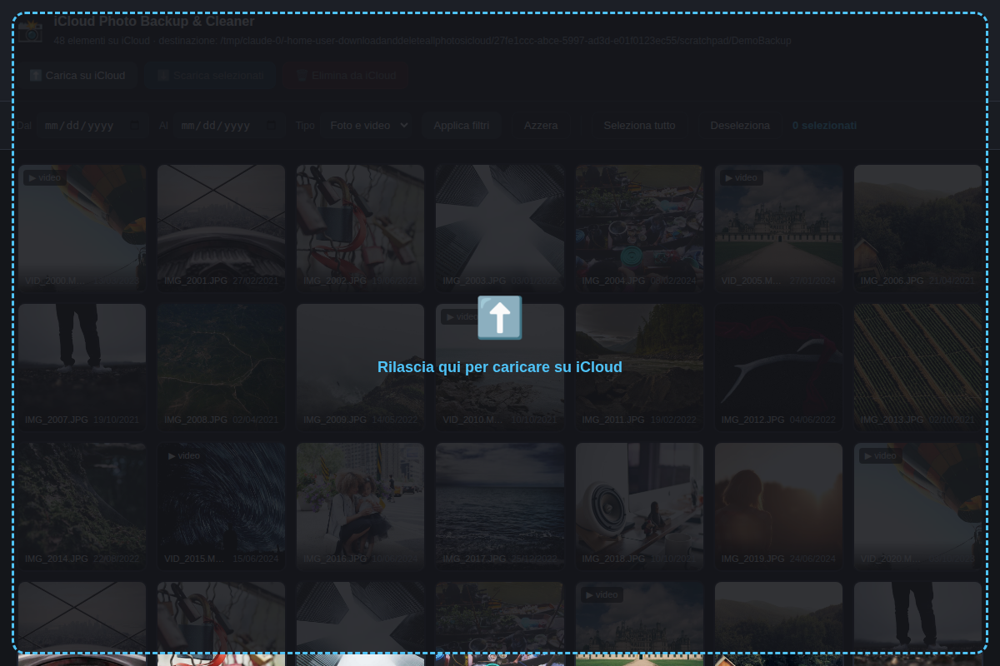

# iCloud Photo Backup & Cleaner 📸 ☁️

Scarica l'intera libreria **iCloud Photos** sul tuo computer, organizzala in cartelle ordinate e — solo dopo che il backup è riuscito — **libera spazio su iCloud** eliminando le foto dal cloud.

Si può usare in **due modi**: con un'**interfaccia grafica** nel browser (vedi le foto e le selezioni col mouse) oppure **solo da terminale**.

<p align="center">
  
</p>

---

## ✨ Cosa fa

| | |
|---|---|
| 🖼️ **Interfaccia grafica** | Vedi le miniature delle tue foto e scegli col mouse cosa scaricare o eliminare |
| ▶️ **Anteprima video** | Clicca `▶ video` su un elemento per riprodurlo direttamente nel browser, senza scaricarlo |
| 🎯 **Selezione mirata** | Filtra **da che data a che data** e **solo foto / solo video** |
| 📅 **Organizzazione automatica** | I file vengono ordinati in `Anno / Mese / Foto o Video` |
| ⏸️ **Riprendibile** | I file già scaricati vengono saltati: se si interrompe, basta rilanciarlo |
| 📊 **Barre di progresso** | Contatore, tempo trascorso e **tempo rimanente stimato** |
| ⬆️ **Caricamento su iCloud** | Carica foto e video verso iCloud: selezione file o trascinamento (drag & drop) nella web UI, oppure `--carica` da terminale |
| 💾 **Ricorda le impostazioni** | Email e cartella di destinazione riproposte al prossimo avvio |
| 🔐 **Password mai salvata** | Input nascosto, nessuna credenziale scritta nel codice o su disco |
| 🔁 **Retry intelligente** | Ritenta sugli errori di rete, si ferma su quelli irrecuperabili |
| 🛡️ **Eliminazione sicura** | Solo dopo il download, con conferma esplicita, e **salta i file non scaricati** |

---

## 🤔 Quale dei due modi scegliere?

| | 🖼️ Interfaccia grafica | ⌨️ Solo terminale |
|---|---|---|
| **Come si avvia** | `python3 photodeleter.py --web` | `python3 photodeleter.py` |
| **Vedi le foto** | ✅ Sì, con le miniature | ❌ No, solo i nomi dei file |
| **Selezione** | Col mouse, una per una o in blocco | Per intervallo di date e tipo |
| **Caricare su iCloud** | ✅ Sì | ❌ No |
| **Adatta a** | Chi vuole scegliere **quali** foto | Chi vuole scaricare/eliminare **tutto** o un intero periodo |

> 💡 **Consiglio**: se è la prima volta, usa l'**interfaccia grafica**. È più semplice e vedi esattamente cosa stai per cancellare.

---

# 🔧 PARTE 1 — Installazione (uguale per entrambi i modi)

> Questa guida presuppone che tu **non abbia mai usato il terminale**. Ogni comando va scritto e poi confermato premendo **Invio**.

## Passo 1 — Apri il terminale

Il "terminale" è la finestra in cui si scrivono comandi testuali.

| Sistema | Come aprirlo |
|---|---|
| 🍎 **macOS** | Premi `Cmd` + `Spazio`, scrivi `Terminale`, premi Invio |
| 🪟 **Windows** | Premi il tasto `Windows`, scrivi `PowerShell`, premi Invio |
| 🐧 **Linux** | Premi `Ctrl` + `Alt` + `T` |

Si apre una finestra con un cursore che lampeggia. È lì che scriverai.

---

## Passo 2 — Controlla di avere Python

**macOS / Linux:**
```bash
python3 --version
```
**Windows:**
```powershell
python --version
```

✅ **Se risponde** `Python 3.11.15` (o simile) → vai al Passo 3.

❌ **Se risponde** `command not found` o `non riconosciuto`:
1. Vai su [python.org/downloads](https://www.python.org/downloads/)
2. Scarica l'ultima versione e installala
3. ⚠️ **Su Windows** spunta la casella **"Add Python to PATH"** nella prima schermata dell'installazione
4. **Chiudi e riapri il terminale**, poi riprova

> Serve Python **3.8 o superiore**.

---

## Passo 3 — Controlla di avere Git

```bash
git --version
```

✅ **Se risponde** `git version 2.43.0` (o simile) → vai al Passo 4.

❌ **Se non è installato**:
* **Opzione A (consigliata)**: installalo da [git-scm.com/downloads](https://git-scm.com/downloads), poi riapri il terminale.
* **Opzione B (senza Git)**: apri la [pagina del progetto](https://github.com/emanuelediluzio/downloadanddeleteallphotosicloud), clicca il pulsante verde **`Code`** → **`Download ZIP`**, estrai la cartella sul Desktop e **salta al Passo 5**.

---

## Passo 4 — Scarica il progetto

### 4a. Spostati sul Desktop

Il comando `cd` significa "*change directory*", cioè "spostati nella cartella".

**macOS / Linux:**
```bash
cd ~/Desktop
```
**Windows:**
```powershell
cd $HOME\Desktop
```

### 4b. Scarica il progetto (clone)

```bash
git clone https://github.com/emanuelediluzio/downloadanddeleteallphotosicloud.git
```

Vedrai scorrere `Cloning into...` e poi `done.`. Sul Desktop è comparsa una cartella nuova.

### 4c. Entra nella cartella

```bash
cd downloadanddeleteallphotosicloud
```

Controlla di essere nel posto giusto:

**macOS / Linux:** `ls` — **Windows:** `dir`

Devi vedere **`photodeleter.py`** e **`requirements.txt`**. Se li vedi, sei nel punto giusto. 🎯

> ⚠️ **Tutti i comandi successivi vanno dati da dentro questa cartella.** Se chiudi il terminale, ricordati di rifare `cd ~/Desktop/downloadanddeleteallphotosicloud`.

---

## Passo 5 — Crea l'ambiente virtuale

Un "ambiente virtuale" è una scatola isolata dove installare le librerie senza sporcare il resto del computer. Su Mac e Linux recenti è **obbligatorio**.

**macOS / Linux:**
```bash
python3 -m venv .venv
source .venv/bin/activate
```
**Windows (PowerShell):**
```powershell
python -m venv .venv
.venv\Scripts\Activate.ps1
```

✅ Se ha funzionato, a inizio riga compare **`(.venv)`**.

> 🪟 **Se Windows dice** *"esecuzione di script disabilitata"*:
> ```powershell
> Set-ExecutionPolicy -Scope Process -ExecutionPolicy Bypass
> ```

> 🔁 **Ogni volta che riapri il terminale** devi rifare solo il comando di attivazione, non ricreare il venv.

---

## Passo 6 — Installa le librerie

Con `(.venv)` visibile:

```bash
pip install -r requirements.txt
```

Attendi finché non compare `Successfully installed ...`.

> 💡 **In alternativa**, se preferisci installare il progetto come un vero comando (senza clonare/attivare nulla ogni volta), salta ai passi 1–4 di questa guida solo per avere Python e Git, poi vai direttamente a **[Installazione con pip/pipx](#-installazione-con-pippipx-alternativa-a-git-clone)** nella sezione "Uso avanzato". Il resto della guida (login, filtri, download...) resta identico: cambia solo come lo avvii.

**L'installazione è finita.** Ora scegli come proseguire:

* 👉 **[PARTE 2 — Interfaccia grafica](#-parte-2--interfaccia-grafica-consigliata)** (consigliata)
* 👉 **[PARTE 3 — Solo terminale](#️-parte-3--solo-terminale)**

---

# 🖼️ PARTE 2 — Interfaccia grafica (consigliata)

## Passo 7 — Avvia con l'opzione `--web`

**macOS / Linux:**
```bash
python3 photodeleter.py --web
```
**Windows:**
```powershell
python photodeleter.py --web
```

## Passo 8 — Inserisci le credenziali nel terminale

Anche usando l'interfaccia grafica, **il login si fa nel terminale** (è più sicuro: la password non passa mai dal browser).

Ti verranno chiesti:
1. **📧 Apple ID** — la tua email Apple
2. **🔑 Password** — 👀 *mentre digiti non vedrai comparire nulla, nemmeno i pallini: è normale, è una misura di sicurezza*
3. **📁 Cartella di destinazione** — premi Invio per accettare `./Backup_iCloud`
4. **🔐 Codice 2FA** — le 6 cifre che compaiono sul tuo iPhone/Mac

## Passo 9 — Si apre il browser

Quando compare:

```text
✓ Interfaccia web avviata.
Apri questo indirizzo nel browser:
http://127.0.0.1:8765/?t=xxxxxxxxxxxx
```

Il browser si apre da solo. Se non lo fa, **copia quell'indirizzo e incollalo** nella barra del browser.

> 🔒 **Il server gira solo sul tuo computer**, non è raggiungibile da internet, e serve quel codice `?t=...` per accedere.

## Passo 10 — Scegli le foto col mouse


Ecco tutti i modi per selezionare:

| Cosa vuoi fare | Come si fa |
|---|---|
| Selezionare **una** foto | Clicca sopra |
| Toglierla dalla selezione | Cliccala di nuovo |
| Selezionare **un intervallo** | Clicca la prima, poi tieni premuto `Shift` e clicca l'ultima |
| Aggiungerne una sparsa | Tieni premuto `Ctrl` (`Cmd` su Mac) e clicca |
| Selezionare **in blocco col mouse** | Premi il tasto sinistro in uno spazio vuoto e **trascina** per disegnare un rettangolo |
| Selezionare **tutto** | Pulsante `Seleziona tutto` oppure `Ctrl+A` (`Cmd+A`) |
| Annullare la selezione | Pulsante `Deseleziona` oppure il tasto `Esc` |

**Selezione trascinando il rettangolo:**



**Anteprima video**: sui video compare in alto a sinistra il pulsante `▶ video` — cliccalo per riprodurre un'anteprima direttamente nel browser (non seleziona la cella, quello resta un click normale sul resto del riquadro):



## Passo 11 — Filtra per data e tipo

In alto puoi restringere ciò che vedi:
* **Dal** / **Al** → mostra solo le foto di quel periodo
* **Tipo** → foto e video, solo foto, solo video
* Poi premi **`Applica filtri`** (o **`Azzera`** per rimuoverli)



## Passo 12 — Scarica quello che hai selezionato

Premi **`⬇️ Scarica selezionati`**. Compare una finestra con la barra di avanzamento. I file vengono salvati ordinati per anno/mese/tipo.

> ⏱️ Con tante foto può volerci parecchio. Lascia la finestra aperta.

## Passo 13 — Elimina da iCloud (con doppia conferma)

Premi **`🗑️ Elimina da iCloud`**. Per sicurezza il pulsante di conferma resta **bloccato** finché non spunti la casella che dichiara che hai già il backup:



> 🛑 **Prima di confermare**, apri la cartella `Backup_iCloud` con Finder/Esplora file e verifica che le foto ci siano davvero e si aprano. Una volta cancellate da iCloud non si torna indietro.

⚠️ Le copie sul tuo computer **non vengono toccate**: viene rimosso solo ciò che sta su iCloud.

## Passo 14 — Caricare foto su iCloud (opzionale)

Due modi, a scelta:

* Premi **`⬆️ Carica su iCloud`** e scegli i file dal computer nella finestra che si apre.
* Oppure **trascina i file col mouse** da una cartella del computer e rilasciali in un punto qualsiasi della pagina: compare un riquadro tratteggiato che conferma dove rilasciarli.



In entrambi i casi i file selezionati vengono caricati nella tua libreria iCloud, con una barra di avanzamento e un riepilogo finale.

## Passo 15 — Quando hai finito

Torna nella finestra del terminale e premi **`Ctrl` + `C`** per spegnere il server.

---

# ⌨️ PARTE 3 — Solo terminale

## Passo 7 — Avvia lo script

**macOS / Linux:**
```bash
python3 photodeleter.py
```
**Windows:**
```powershell
python photodeleter.py
```

Comparirà il riquadro azzurro con il titolo del programma. 🎉

## Passo 8 — Inserisci i tuoi dati

**1. `📧 Apple ID`** — l'email del tuo account Apple.

**2. `🔑 Password`** — 👀 *mentre digiti non vedrai comparire nulla, nemmeno i pallini. È normale: il terminale nasconde la password. Scrivi e premi Invio.*

**3. `📁 Cartella di destinazione`** — premi **Invio** per accettare `./Backup_iCloud`, oppure scrivi un percorso completo (es. `/Volumes/DiscoEsterno/Foto` su macOS, `D:\Foto` su Windows).

## Passo 9 — Codice di verifica (2FA)

Inserisci le **6 cifre** che compaiono sul tuo iPhone/Mac.

✅ Quando leggi `✓ Accesso effettuato con successo` sei dentro.


## Passo 10 — Scegli cosa scaricare ed eliminare

```text
Quali elementi vuoi elaborare?
  1) Tutta la libreria
  2) Solo un intervallo di date
Scelta [1/2] (1):
```
* Premi **Invio** (o `1`) per prendere tutto.
* Scrivi **`2`** per un periodo: ti chiederà **data di inizio** e **data di fine** nel formato `GG/MM/AAAA` (es. `01/01/2020`). Lasciando vuota una delle due, quel limite non viene applicato.

```text
Quale tipo di media?
  1) Foto e video
  2) Solo foto
  3) Solo video
Scelta [1/2/3] (1):
```

> 🔒 **La selezione vale per entrambe le fasi**: se scegli "solo il 2020", verranno scaricate *e* poi eliminate soltanto le foto del 2020. **Il resto della libreria non viene toccato.**

## Passo 11 — Aspetta il download


I numeri da sinistra a destra:
* **`2385/3847`** → file scaricati su totale
* **`0:08:32`** → da quanto sta lavorando
* **`0:05:14`** → **quanto manca** (stima)

**Righe gialle** `⚠ Riprovo tra 30s` → normale: i server Apple sono occupati, riprova da solo.

**Puoi interrompere** con `Ctrl` + `C` e riprendere più tardi: i file già scaricati verranno saltati.

## Passo 12 — Controlla il riepilogo e conferma


> 🛑 **FERMATI E CONTROLLA.** Apri la cartella `Backup_iCloud` e verifica con i tuoi occhi che le foto ci siano e si aprano, prima di rispondere.

Alla domanda `Procedere con l'eliminazione da iCloud? [y/n] (n):`
* **`n`** o solo Invio → non cancella niente ed esce
* **`y`** → cancella da iCloud (le copie locali restano intatte)


---

# 📁 Dove finiscono le foto

Nella cartella che hai scelto, ordinate per anno, mese e tipo:

```text
Backup_iCloud/
├── 2023/
│   ├── 01/
│   │   ├── Foto/
│   │   │   └── IMG_001.JPG
│   │   └── Video/
│   │       └── VIDEO_002.MOV
│   └── 05/
│       └── Foto/
│           └── IMG_042.HEIC
└── 2024/
    └── 12/
        └── Foto/
            └── IMG_999.PNG
```

---

# 🔄 Come rilanciarlo in futuro

Riapri il terminale e dai i comandi in fila:

**macOS / Linux:**
```bash
cd ~/Desktop/downloadanddeleteallphotosicloud
source .venv/bin/activate
python3 photodeleter.py --web      # oppure senza --web per il terminale
```
**Windows:**
```powershell
cd $HOME\Desktop\downloadanddeleteallphotosicloud
.venv\Scripts\Activate.ps1
python photodeleter.py --web
```

Email e cartella di destinazione te le ricorderà lui: basta premere Invio.

---

# 🆘 Problemi comuni

| Messaggio d'errore | Cosa significa e come si risolve |
|---|---|
| `command not found: python3` <br> `python non è riconosciuto` | Python non installato o non nel PATH → rifai il **Passo 2**. Su Windows reinstalla spuntando *"Add Python to PATH"* |
| `No such file or directory: photodeleter.py` | Non sei nella cartella del progetto → `cd ~/Desktop/downloadanddeleteallphotosicloud` |
| `externally-managed-environment` | Stai installando fuori dall'ambiente virtuale → rifai il **Passo 5**, deve comparire `(.venv)` |
| `✗ Manca la libreria Flask` | Non hai installato le dipendenze → rifai il **Passo 6** |
| `✗ Credenziali errate` | Email o password sbagliate. Se sei sicuro, genera una **password per app** dalla sezione sicurezza del tuo account su `appleid.apple.com` |
| `✗ Codice non valido` | Il codice 2FA è scaduto → rilancia e usa il nuovo codice |
| `Address already in use` (porta occupata) | Un altro programma usa la porta → avvia con `--porta 9000` |
| La pagina dice *"Impossibile contattare il server"* | Hai aperto l'indirizzo senza il codice `?t=...` → ricopia il link completo dal terminale |
| `esecuzione di script è disabilitata` (Windows) | `Set-ExecutionPolicy -Scope Process -ExecutionPolicy Bypass`, poi riattiva il venv |
| `✗ Errore filesystem locale` | Disco pieno o permessi negati → libera spazio o cambia cartella |
| Righe gialle `⚠ Riprovo tra 30s` | **Non è un errore.** Server Apple occupati, riprova da solo. Aspetta |

---

# ⚙️ Uso avanzato

## 📦 Installazione con pip/pipx (alternativa a `git clone`)

Il progetto è anche un vero pacchetto Python, installabile senza clonare il repository manualmente né attivare un ambiente virtuale a ogni avvio. È l'equivalente Python di `npx`/`npm` per chi viene da Node.js: la libreria standard di Python per questo è [`pip`](https://pip.pypa.io) (installazione permanente) o [`pipx`](https://pypa.github.io/pipx/) (installazione isolata automaticamente in un proprio ambiente, consigliata per gli eseguibili).

**Con `pipx` (consigliato):**

```bash
# Installa pipx una tantum, se non lo hai gia'
python3 -m pip install --user pipx
python3 -m pipx ensurepath   # poi riapri il terminale

# Installa il progetto direttamente dal repository GitHub
pipx install "git+https://github.com/emanuelediluzio/downloadanddeleteallphotosicloud.git"
```

**Con `pip`, dentro un ambiente virtuale:**

```bash
python3 -m venv .venv && source .venv/bin/activate   # .venv\Scripts\Activate.ps1 su Windows
pip install "git+https://github.com/emanuelediluzio/downloadanddeleteallphotosicloud.git"
```

**Da una copia locale già clonata** (utile se stai modificando il codice):

```bash
cd downloadanddeleteallphotosicloud
pipx install .          # oppure: pip install -e .   (modalità "editable", per sviluppo)
```

Una volta installato, in tutti i casi è disponibile un nuovo comando **`icloud-photo-backup`**, equivalente a `python3 photodeleter.py`:

```bash
icloud-photo-backup            # solo terminale
icloud-photo-backup --web      # interfaccia grafica
icloud-photo-backup --help     # elenco opzioni
```

> ⚠️ Il pacchetto **non è ancora pubblicato su PyPI** (il registro pubblico da cui si installa con solo `pip install icloud-photo-backup-cleaner`, senza indicare un repository). Per ora va installato da GitHub o da una copia locale come mostrato sopra. Pubblicarlo su PyPI richiede un account personale su pypi.org: è un passo che riguarda la distribuzione pubblica del progetto, da fare quando (e se) lo si decide esplicitamente.

## Selezione da riga di comando

Puoi passare i filtri direttamente al comando, saltando le domande:

```bash
# Solo il 2020, foto e video
python3 photodeleter.py --da 01/01/2020 --a 31/12/2020

# Tutti i video precedenti al 2019
python3 photodeleter.py --a 31/12/2018 --tipo video

# Solo le foto, di qualsiasi data
python3 photodeleter.py --tipo foto

# Interfaccia grafica su una porta diversa
python3 photodeleter.py --web --porta 9000

# Carica un singolo file su iCloud
python3 photodeleter.py --carica ./vacanze/foto_spiaggia.jpg

# Carica tutte le foto/video di una cartella (ricorsivo) su iCloud
python3 photodeleter.py --carica ./vacanze
```

| Argomento | Descrizione |
|---|---|
| `--web` | Avvia l'interfaccia grafica nel browser |
| `--porta N` | Porta dell'interfaccia web (predefinita: 8765) |
| `--da GG/MM/AAAA` | Elabora solo da questa data in poi |
| `--a GG/MM/AAAA` | Elabora solo fino a questa data |
| `--tipo {tutti,foto,video}` | Limita a sole foto o soli video |
| `--carica PERCORSO` | Carica su iCloud un file, o una cartella intera, invece di scaricare/eliminare |

Accettati anche i formati `AAAA-MM-GG` e `GG-MM-AAAA`. Le date sono **inclusive**.

Con `--carica` su una cartella, vengono presi solo i file con estensione foto/video riconosciuta (jpg, png, heic, mov, mp4, ecc. — [elenco completo nel codice](src/icloud_photo_backup/cli.py)); un singolo file indicato esplicitamente viene invece sempre caricato. `--carica` non si può combinare con `--web`.

Elenco completo delle opzioni: `python3 photodeleter.py --help`

## Variabili d'ambiente (per automazioni)

**macOS / Linux:**
```bash
export ICLOUD_EMAIL="tuo_id@icloud.com"
export ICLOUD_PASSWORD="tua_password"
export ICLOUD_BACKUP_PATH="./Backup_iCloud"
python3 photodeleter.py
```
**Windows (PowerShell):**
```powershell
$env:ICLOUD_EMAIL="tuo_id@icloud.com"
$env:ICLOUD_PASSWORD="tua_password"
$env:ICLOUD_BACKUP_PATH=".\Backup_iCloud"
python photodeleter.py
```

> ⚠️ Con questo metodo la password resta nella cronologia della shell. Preferisci il metodo interattivo se il computer è condiviso.

## Impostazioni memorizzate

Email e cartella di destinazione vengono salvate in `~/.icloud_photodeleter_config.json`. **La password non viene mai salvata su disco.** Per azzerare, cancella quel file.

## Gestione degli errori

| Tipo di errore | Comportamento |
|---|---|
| **Rete / server occupato** (503, connessione persa) | Ritenta con attesa progressiva (5s → 10s → 30s), senza perdere file |
| **Autenticazione / permessi** (401, 403) | Ritenta 3 volte, poi salta il file: viene **escluso dall'eliminazione** |
| **Disco locale** (spazio esaurito, permessi) | Interrompe subito con un messaggio chiaro |

I file da 0 byte (download corrotti) vengono rilevati e riscaricati automaticamente.

## Note tecniche sull'interfaccia web

* Il server ascolta **solo su `127.0.0.1`** (il tuo computer), non è raggiungibile dalla rete.
* Ogni avvio genera un **codice di accesso casuale** richiesto da tutte le chiamate API.
* Le miniature vengono messe in cache nella sottocartella nascosta `.miniature` della cartella di destinazione, così al secondo avvio si caricano subito.
* Le miniature si scaricano **solo quando compaiono sullo schermo**, per non intasare la connessione con librerie grandi.

## Rigenerare gli screenshot del terminale

```bash
python docs/generate_screenshots.py
```

## 🤖 Contribuire con un agente AI (Claude Code e simili)

Il repository include due file pensati per chi sviluppa con l'aiuto di un agente AI:

* **[`AGENTS.md`](AGENTS.md)** — struttura del progetto, convenzioni di sicurezza da non violare, come testare senza credenziali iCloud reali.
* **[`.claude/skills/icloud-photo-backup-dev/`](.claude/skills/icloud-photo-backup-dev/SKILL.md)** — una skill per [Claude Code](https://claude.com/claude-code) con la procedura di test collaudata su questo progetto (foto/video finti, server demo, verifica con Playwright). Chi clona il repo e lavora con Claude Code la trova già disponibile in automatico; se vuoi solo prenderla per un altro progetto, il file è liberamente copiabile.

---

# ⚠️ Avvertenze importanti

* **Verifica lo spazio libero**: una libreria iCloud può pesare decine o centinaia di GB.
* **L'eliminazione è definitiva**: i file passano nel cestino di iCloud o vengono rimossi permanentemente a seconda delle impostazioni del tuo account.
* **Controlla sempre il backup prima di cancellare**: apri la cartella e verifica che le foto ci siano e si aprano.
* **Connessione stabile**: meglio via cavo o Wi-Fi affidabile. In caso di interruzione lo script riprende da dove era rimasto.

---

# 🔮 Roadmap / To-Do

* **☁️ Supporto Multi-Cloud**: caricamento diretto su Google Drive, OneDrive e Dropbox.
* **🔄 Streaming Transfer**: trasferimento "pipe" da iCloud al cloud di destinazione senza salvare in locale.
* **🔐 Crittografia (opzionale)**: cifratura dei file prima dell'upload sul cloud di destinazione.
